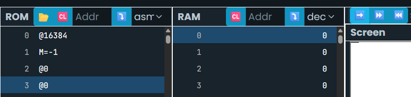

# **Actividad 1: Dibujando un punto en la pantalla**

### Escribe un programa que dibuje un punto negro en la esquina superior izquierda de la pantalla.
### Traduce este programa a lenguaje C++.

- Aquí se sabe ya que @16384 es donde comienza a escribirse en la pantalla
``` asm
@16384
M=1
```

- Hipótesis de código C++
``` c++
ñ
```


- Se agregó un 1 para que el primer valor del binario de la dirección de memoria sea un 1 en vez de un 0 y se pinta ese punto


# **Actividad 2: Dibujando una línea horizontal**

### Modifica el programa anterior para que dibuje una línea horizontal negra de 16 pixeles de largo en la esquina superior izquierda de la pantalla.
### Traduce este programa a lenguaje C++.

- Con la misma información, revisé con el binario para notar que cambiar los 16 valores por un 1 equivale a -1 en decimal
``` asm
@16384
M=-1
```

- Así que lo apliqué y así mismo me dio la línea completa

- Hipótesis de código C++
``` c++
ñ
```

# **Actividad 3: Entrada salida interactiva**

Modifica el programa de la actividad anterior de tal manera que puedas mover la línea horizontal de derecha a izquierda usando las teclas **d** e **i** respectivamente.

Traduce este programa a lenguaje C++.

- Pseudocódigo: Se tendría que realizar la siguiente operación:
```
Leer KBD
{
if KBD = 0
    go to keyboard
        if KBD = 105

            RAM[20496]=0 // Izquierda
            RAM[20496]=-1

    go to keyboard
}
```